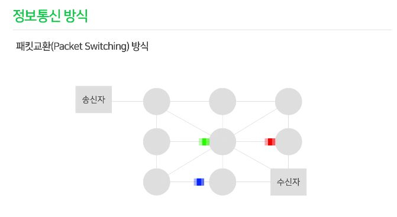
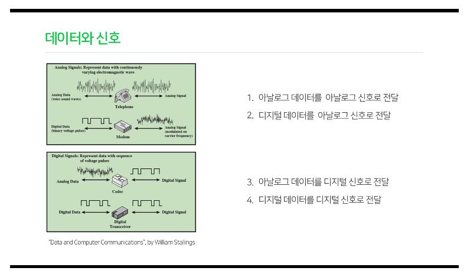

# 통신의 기초
출처 : edwith https://www.edwith.org/tel-ewha-course

## 1강 통신이란?
우리나라가 IT강국이라고 하는데 IT란 Information Technology 정보기술을 의미한다. 

최근에는 ICT라는 말이 많아졌는데 이는 Information Communication Technology 즉, 정보통신기술이다. 그만큼 독립적으로 떨어진 한 컴퓨터에서 행하는 일보다 통신을 하며 이루어지는 일이 훨씬 중요한 것이 되었다.

통신이란?
- 통신 : 정보나 의사를 주고 받음. 사람 또는 기계들 간에 **다양한 매체**를 이용 정보를 전달.
- 통신의 목적 : 자신의 의사를 **정확히** 전달하는 것

따라서 통신은 다음 세가지 요소가 꼭 필요하다.

1. 정보원 : 송신자, 수신자
2. 통신매체 : 채널, 링크, 회선
3. 프로토콜 : 적절한 대화절차, 약속된 형식, 공통된 언어
## 2강 정보통신의 의미
### 정보통신의 의미
- 데이터(data) : 가공되지 않은 자료
- 정보(information) : 우리 생활 주변에 산재되어있는 데이터들을 수집 가공처리하여 사용목적에 따라 잘 정돈한 유용한 상태
- 통신(communication) : 사람 또는 기계들 간에 **다양한 매체**를 이용 정보를 전달
- 정보통신 : 정보 전송기술과 컴퓨터에 의한 정보의 처리 기능을 결합한 것
### 정보통신의 개요
우리나라에서 정보통신은 1960년대 전신과 전화의 형태로 시작되었다. 1970년대 데이터 통신, 컴퓨터 통신, 팩스 통신이 등장했다

### 정보통신의 형태
- 단방향통신 : 방송, 라디오, 이메일 등 한쪽으로만 정보가 전달되는 형태
- 양방향통신 : 전화와 같이 통신기기가 서로 정보를 주고받을 수 있는 교신 형태 여기서 또 두개로 나뉜다.
  - 전이중(Full duplex) : 전화처럼 송신 수신이 동시에 되는 것.
  - 반이중(Half duplex) : 무전기처럼 한번에 한쪽 방향으로 밖에 못가는 것.

## 3강 정보통신의 방식

1. 회선교환(Circuit Switching)방식
    - 통신 기간 동안 독점적인 사용을 위해 두 통신 노드 사이를 연결.
    - 즉 두 노드가 연결되면 해당 path는 점유가 되어버려 다른 사람들은 사용을 못함.
2. 패킷교환(Packet Switching)방식
    - 작은 블록의 패킷으로 데이터 전송
    - 데이터를 전송하는 동안만 네트워크 자원을 사용하기 때문에 이용률이 높다!
    - 네트워크 연결 사으이 모든 노드들 사이에 개별적으로 경로가 제어되고 회선을 공유함
    - 각 패킷은 서로 다른 경로를 통해 전달될 수 있고 도착해서 다시 정렬된다.
    - 현재 가장 많이 사용되는 통신 방식이다.

## 4강 데이터와 신호

- 데이터(Data) : 자료
- 정보(Information) : 데이터를 가공 처리(Processing)한 것
- 신호(Signal) : 상대방한테 전달하기 위해서 정보를 변환한 것  

예를 들어 생일 축하를 상대방한테 전달하려면 음향, 텍스트, 이미지, 비디오등 여러가지 정보 혹은 데이터 타입을 전송 매체를 통해 신호로 바꾸어야 한다.

### 데이터의 두가지 종류
1. 아날로그 데이터
2. 디지털 데이터

### 신호의 두가지 종류
1. 아날로그 신호
    - 어떤 양 또는 데이터를 연속적으로 변화하는 물리량으로 표현
    - 곡선 형태로 전달
2. 디지털 신호
    - 어떤 양 또는 데이터를 2진수의 조합으로 표현하는 것
    - 1 또는 0 이라는 숫자로 전달(이산적으로 전달)

### 데이터가 신호로 바뀌는 경우 네가지

데이터도 두가지 신호도 두가지가 있으니 조합하면 4가지 형태가 존재한다.
1. 아날로그 데이터 -> 아날로그 신호 : 유선 전화기
2. 디지털 데이터 -> 아날로그 신호 : 통신망이 구축되지 않은 초기에는 유선 망을 사용 했었는데 이 때 등장한 것이 모뎀이다. 모뎀은 Modulation 과 De-modulation을 합쳐 부르는 건데 컴퓨터에서 생성되는 디지털 신호를 유선 전화망을 통해 아날로그 신호로 전달하고 그것을 다시 디지털화 시키는 장치이다.
3. 아날로그 데이터 -> 디지털 신호 : 대표적으로 코덱이라는 장비가 있다. 이를테면 영상이나 소리를 녹화/녹음할 때 아날로그 데이터를 디지털 신호로 바꾸어주는 것이 코덱이다.
4. 디지털 데이터 -> 디지털 신호 : 우리가 가장 많이 사용하는 것. 요즘 우리가 사용하는 인터넷 통신.

## 5강 통신망의 종류
통신망을 분류하는 기준엔 여러가지가 있지만 가장 많이 쓰이는 기준은 **규모**에 따른 분류이다.
### 1. LAN(Local Area Network)
같은 조직안에 있는 컴퓨터들 끼리 연결하자는 목적으로 만들어졌다(그 때는 플로피 디스크로 서로 공유했어야 하는데 이건 용량도 작고 번거롭고 귀찮았으니까).
- 우리말로 하면 근거리 통신망이다.
- 수미터에서 수킬로미터 반경의 망이다.
- 전송매체는 전화선, 동축케이블, 광섬유 등이 있다.
### 2. MAN(Metropolitan Area Network)
LAN이 도시규모로 확장된 것이 MAN이다.
### 3. WAN(Wide Area Network)
이런 LAN, MAN을 전세계적으로 연결 시킨 것이 WAN이다.
- 공중망(public network)을 이용한다.
- 수백, 수천 킬로미터의 거리를 연결한다.
- 국가 간, 대륙 간 전 세계 네트워크 망

그런데 이렇게 확장되니 서로 다른 컴퓨터 시스템 간의 연결, 장거리 데이터 전송, 효과적 네트워크 관리, 위성 및 케이블을 통한 대륙 간 연결 등의 고급기술이 필요했다.

이러한 문제를 해결 하기 위해 **통신 프로토콜**이 생겼다.

## 6강 전자기파

전자기파는 전기와 자기를 합친 이름이다. 전기가 자기를 유도하고 자기가 전기를 유도하는 것은 우리가 초중고등학교 때 배웠던 사실이다. 파장이 길든 짧든 같은 파동이므로 속도가 같다.

빛도 전자기파의 일부이다(즉, 가시광선도 통신을 위해 쓰일 수 있다! 색깔이 다른 빛을 쏴주고 그 빛을 통해 정보를 읽는 통신 예시를 박물간 따위에서 보여주면 재밌을듯!).

전자기파가 중요한 이유는 우리의 신호가 전자기파를 통해서 전송되기 때문이다.

### 정보용량
- bit : 0 또는 1의 한자리 즉 두가지 정보를 표현 가능
- byte : 8bit를 묶은 단위
- KB(kilo Byte) : 210 byte
- MB(Mega Byte) : 220 byte
- GB(Giga Byte) : 230 byte
- TB(Tera Byte) : 240 byte

## 7강 전송매체
신호를 전달하는 매개체가 전송매체이다. 전송매체에는 유선매체 무선매체가 있다.
1. 유선매체
    - 꼬임상선(Twisted Pair) : 가장 많이 쓰이고 단순한 매체, 유선전화망에 쓰였고 저렴함. 효율성은 많이 떨어짐.
    - 동축 케이블(Coaxial Cable) : 폭넓은 주파수 범위를 허용. 장거리 전화망, 유선TV, 근거리 통신망에 많이 쓰여왔음.
    - 광섬유(Fiber Optics) : 보통 플라스틱이나 유리 섬유로 만들어져 있다. 넓은 대역폭, 빠른 속도, 높은 보안성을 제공한다. 최근에는 높았던 비용도 많이 저렴해졌다. 
