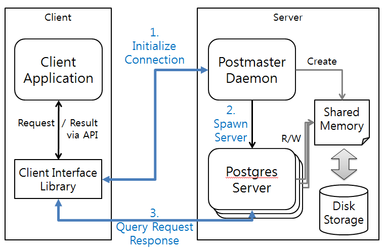
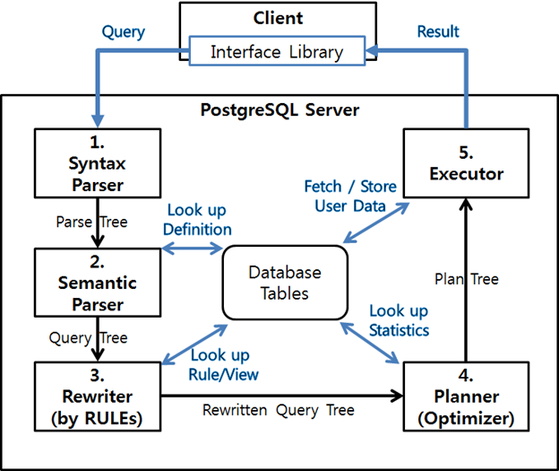
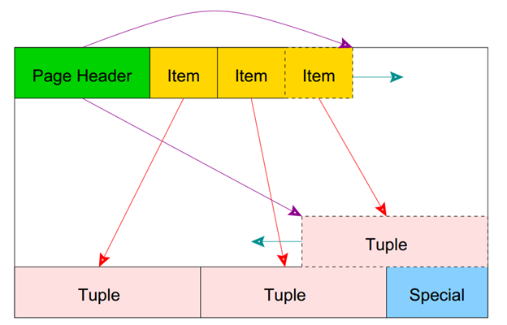
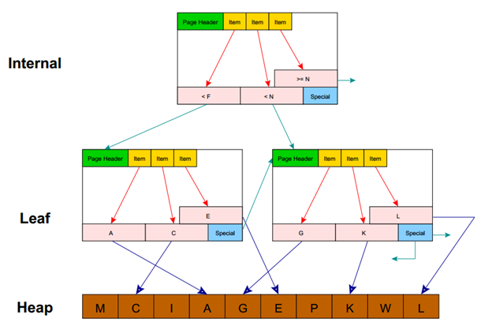

## PostgreSQL
출처 : [D2. 한눈에 살펴보는 PostgreSQL](https://d2.naver.com/helloworld/227936)
PostgreSQL는?
1. PostgreSQL은 북미와 일본에서 높은 인지도와 인기를 얻고 있다.
2. 발음은 포스트-그레스-큐엘(Post-gress-Q-L)로 부른다.
3. 객체-관계형 데이터베이스 매니지먼트 시스템이다.(ORDBMS)
4. 오라클과 유사한 점이 많아. 오라클 사용자가 가장 쉽게 적응할 수 있는 오픈소스 DBMS이다.
5. 5432 port를 쓴다. 그래도 기억하기 쉽게하려고 저렇게 잡았나보다.
6. 여러 조상격인 제폼들이 있는데 그중 Ingres(INteractive Graphics REtrieval System)가 PostgreSQL의 시조라고 할 수 있다. 이 Ingres는 현재까지도 활발하게 활동하고 있는 데이터베이스 계의 거장 Michael Stonebraker가 시작한 프로젝트다. 이 Ingres는 1977년 미국 버클리대학에서 시작한 프로젝트다. 이후 Ingres를 잇는 Postgres(Post-Ingres)라는 또 다른 프로젝트 또한 그의 손을 거쳐 탄생됐다.
7. PostgreSQL의 로고는 'Slonik'이라는 이름을 가진 코끼리다. 코끼리를 로고로 사용하게 된 정확한 근원은 찾을 수 없으나 과거의 흔적을 뒤져 보면, 오픈소스화된 직후 한 사용자가 아가사 크리스티의 소설 '코끼리는 기억한다'에서 착안해 제안한 것으로 보인다. 이후 모든 공식적인 자리에서 이 코끼리 로고는 빠지지 않고 등장하게 됐다. 코끼리는 크고 강하고 믿음직하며 기억력이 좋다는 이미지 때문에 Hadoop이나 Evernote도 코끼리를 공식 로고로 사용하고 있다.
8. PostgreSQL은 관계형 DBMS의 기본적인 기능인 트랜잭션과 ACID(Atomicity, Consistency, Isolation, Durability)를 지원한다. 또한 ANSI SQL:2008 규격을 상당 부분 만족시키고 있으며, 전부를 지원하는 것을 목표로 현재도 기능이 계속 추가되고 있다.

### PostgreSQL의 일반적 제한사항
항목	| 제한 사항
-|-
최대 DB 크기(Database Size)|	무제한
최대 테이블 크기(Table Size)|	32TB
최대 레코드 크기(Row Size)|	1.6TB
최대 컬럼 크기(Field Size)|	1 GB
테이블당 최대 레코드 개수(Rows per Table)|	무제한
테이블당 최대 컬럼 개수(Columns per Table)|	250~1600개
테이블당 최대 인덱스 개수(Indexes per Table)|	무제한

### 프로세스 구조


클라이언트는 인터페이스 라이브러리(libpg, JDBC, ODBC)를 통해 서버와의 연결 요청(1)을 하면 Postmaster 프로세스가 서버와의 연결을 중계(2)한다. 이후 클라이언트는 할당된 서버와의 연결을통해 질의를 수행(3)한다.


클라이언트로부터 질의 요청이 들어오면 구문 분석 과정(1)을 통해 Parse Tree를 생성하고(약간 컴파일러 배울 때 AST-Abstract Syntax Tree 랑 비슷한 것 같다!) 의미 분석 과정(2)를 통해 새로운 트랜잭션을 시작하고 Query Tree를 생성한다.

이후 서버에 정의된 Rule에 따라 Query Tree가 재 생성(3)되고 실행 가능한 여러 수행 계획 중 가장 최적화된 Plan Tree를 생성(4)한다. 서버는 이를 수행(5)하여 요청된 질의에 대한 결과를 클라이언트로 전달하게 된다.

실제 동작은 (5)에서만 진행되고 그 앞의 과정은 쿼리에 따라 최적화된 수행계획을 작성하는 것이다(최적화를 많이 염두했나보다! v8엔진도 생각이 난다!).

서버의 쿼리 수행 과정에서는 데이터베이스 내부의 시스템 카탈로그가 많이 사용되는데, 사용자가 함수나 데이터 타입은 물론 인덱스 접근 방식 및 RULE 등을 시스템 카탈로그에 직접 정의할 수도 있다. 따라서 PostgreSQL에서는 이것이 기능을 새로 추가하거나 확장하는데 있어 중요한 포인트로 활용된다. => **한 마디로 룰을 직접 정의할 수 있어서 새로운 기능 추가나 확장이 용이하다!**



데이터가 저장되는 파일들은 여러 개의 페이지들로 구성되며, 하나의 페이지는 확장 가능한 slotted page 구조를 가진다.



### 개발 프로세스
PostgreSQL의 개발 프로세스 모델은 다음의 문장으로 설명할 수 있다.
"소수 주도의 커뮤니티 기반 오픈 소스 프로젝트"
소수의 관리자가 다수의 개발자/사용자로부터 요청과 피드백을 받고 코드의 최종 승인 및 릴리즈 권한을 행사한다.

이전부터 PostgreSQL 진영은 엔터프라이즈 시장에 진출하려는 시도를 계속 해 왔고, 2004년에는 PostgreSQL을 이용한 전문 기업인 EnterpriseDB(http://www.enterprisedb.com) 가 생겨나 엔터프라이즈 DBMS 시장을 좀 더 확고히 다지기 위한 노력을 기울이고 있다. 대표적인 산출물이 Postgres Plus Advanced Server 제품의 출시다. 이는 오픈 소스 PostgreSQL에 Oracle 호환성 기능(PL/SQL, SQL 구문, 함수, DB Links, OCI 라이브러리 등 지원)과 관리 도구를 추가해 용이한 데이터 및 응용 마이그레이션과 Oracle 대비 20% 이하의 비용 절감을 주무기로 내세우고 있다

PostgreSQL자체는 영리적 목적으로도 쓸 수 있다! BSD 라이센스이기 때문이다!

### 현황, 동향
대부분의 PostgreSQL 사용기를 읽어 보면 알 수 있듯이 PostgreSQL을 사용하는 사람들은 대부분 개발자적인 성향을 가지고 있으며 제품에 대한 애정도와 충성도가 높은 편이다.

프로젝트 페이지에 잘 정리된 매뉴얼, 문서와 300종 이상의 관련 서적, 그리고 세계 각국에서 개최되는 매년 10회 이상의 다양한 세미나와 콘퍼런스 등도 이를 뒷받침하고 있으며 최근에는 전문 잡지까지 등장했다. 이는 모두 왕성한 커뮤니티 활동의 산물이라 할 수 있다.

### 사용자가 꼽는 PostgreSQL의 대표적 특징
- '신뢰도'는 제품의 최우선 사항
- ACID 및 트랜잭션 지원
- 다양한 인덱싱 기법 지원
- 유연한 Full-text search 기능
- 동시성 성능을 높여주는 MVCC 기능
- 다양하고 유연한 복제 방식 지원
- 다양한 프로시져(PL/pgSQL, Perl, Python, Ruby, TCL, 등)/인터페이스(JDBC, ODBC, C/C++, - .Net, Perl, Python, 등) 언어
- 질 좋은 커뮤니티 지원 및 상업적인 지원
- 잘 만든 문서 및 충분한 매뉴얼 제공

### 이 글을 작성하며 복습 혹은 알게 된 것!
1. 마크다운에서 nested list는 스페이스 네번을 치고 다시 리스트를 쓰면된다.
2. transaction

    누군가 어떤 것을 사거나 팔 때 혹은 돈이 오갈 때, 혹은 사거나 파는 행위 자체를 의미한다. (an occasion when someone buys or sells something, or when money is exchanged or the activity of buying or selling something).

    데이터베이스에서 트랜잭션이란 상호작용의 단위이다. 이론적으로 DBMS는 원자성(Atomicity), 일관성(Consistency), 독립성(Isolation), 영구성(Durability)을 보장한다. 이 성질을 첫글자를 따 ACID라 부른다.

    어떤 시스템들에서는 트랜잭션들은 논리적 작업 단위(LUW, Logical Units of Work)로 불린다.

    한마디로 쿼리가 DBMS에 보내지고, 해당 쿼리를 실행하고, 그 실행이 성공하기 까지의 처리과정을 한 단위로 묶어 트랜잭션이라 한다.

    더 쉽게 말하면 그냥 쿼리 보내고 잘 실행 됐는가가 한 트랜잭션이다.
3. fetch
    
    가지고 오다. go for and then bring back (someone or something) for someone.

4. tuple

    유한 개의 사물의 순서 있는 열거. 수학에선 벡터 컴퓨터 사이언스에서는 어떤 요소의 집합 혹은 테이블의 한 row를 가리킨다(=record). 단 일반적인 집합과달리 중복이 허용될 수 있다. 대개는 괄호 '( )'안에 쉼표 ','로 구분한다. 예를들어 (2, 7, 4, 1, 7)와 같다.

5. 막간 괄호 표현 정리
    - () parentheses
    - {} curly bracket or brace
    - [] square bracket or just bracket(US)
    - <> pointy bracket or less than greater than

6. MySQL도 영리 목적은 유료! PostgreSQL은 영리도 무료!

    찾으면서 알게 된 사실인데 MySQL도 완전한 무료가 아니다. 영리 목적으로 사용시에는 유료 버전을 써야하고 유료버전의 가격은 2000~10000달러 사이이다. 무료 버전은 GPL(General Public License)이 적용되어 있어 MySQL 내부의 소스 코드 수정시 공개해야하지만 유료버전은 소스 공개의 위험이 없다. 유료버전은 고객지원이 좋지만 무료버전은 없다.

7. BSD 라이센스
    
    - BSD 운영체제 : 는 1977년부터 1995년까지 미국 캘리포니아 대학교 버클리(University of California, Berkeley)의 CSRG(Computer Systems Research Group)에서 개발한 유닉스 운영 체제이다.
    - BSD 라이선스 : 해당 소프트웨어는 아무나 개작할 수 있고, 수정한 것을 제한 없이 배포할 수 있다. 다만 수정본의 재배포는 의무적인 사항이 아니므로 BSD 라이선스를 갖는 프로그램은 공개하지 않아도 되는 상용 소프트웨어에서도 사용할 수 있다.

8. ACID(Atomicity, Consistency, Isolation, Durability)

    데이터베이스 트랜잭션이 안전하게 수행된다는 것을 보장하기 위한 성질을 가리키는 약어이다.
    
    

    - Atomicity : Transaction are all or nothing. 트랜잭션중에 중단 안됨 보장!
    - Consistency : Only valid data is saved. 유효성을 체크하고 저장하기 때문에 일관된 데이터타입 보장!
    - Isolation : Transactions do not affect each other. 트랜잭션중 다른 트랜잭션끼지 못하게 보장!(스택!)
    - Durability : Wirtten data will not be lost. 트랜잭션이 끝나면 쓰여진 데이터는 시스템이 꺼져도 저장된다는 것을 보장!(비휴발성 non-volatile 메모리에 저장된다는 것을 의미)

9. DbaaS(DB As A Service)

    한마디로 DB를 클라우드로 제공해주는 서비스. 이런 회사들이 많아졌다.

10. scratch

    모두들 사용해봤을 블록코딩 프로그램의 이름이기도 한데 출발점이란 뜻도 있다. 

11. ORM

    Object-relational mapping의 약자이다. 컴퓨터 사이언스에서 데이터(DB)를 호환되지 않는 다른 타입시스템(이를테면 백엔드)에서 객체지향 언어를 통해 컨버팅해주는 기술이다.

12. Type system

    프로그래밍 언어에서 타입시스템이란 타입이라고 부르는 프로퍼티를 컴퓨터 프로그램의 다양한 구조(예를 들어 변수, 표현식, 함수, 모듈)에 할당하는 규칙의 집합이다. 이러한 타입(데이터 형)은 프로그래머가 데이터 타입이나 구조, 기타 구성 요소를 정규화하고 타입을 강제합니다.
    한마디로 static typing이라고 생각하면 될듯.
### Tutorial
참고 : [postgresql official tutorial](https://www.postgresql.org/docs/10/tutorial-start.html)

#### 1.1. 설치
나와 같은 경우는 맥에서 .app의 파일을 받아서 설치하고 대화형 창을 통해서(GUI) 비밀번호와 포트를 설정해주었다. 다만 이렇게 설치할 경우 그냥 터미널에서 psql 로 접속은 하지 못하고 SQL-Shell이라는 프로그램을 통해서 실행해주어야 했다.

#### 1.2. 기초 개념(Architectural Fundamentals)
postgresql은 client/server모델을 사용한다. 하나의 postgresql 세션은 협력관계인 두가지 프로세스로 이루어진다.

1. 서버\
데이터베이스 파일을 매니징하며 클라이언트 어플리케이션으로 부터 커넥션을 받아들인다. 그리고 클라이언트를 대신해서 어떤 액션을 수행한다. 데이터베이스 서버 프로그램을 postgres라고 한다.

2. 클라이언트\
데이터베이스 동작을 하고 싶어하는 어플리케이션. 클라이언트 어플리케이션은 다양할 수 있다(Node, Java등 어떤 백엔드언어를 쓰는지에 따라 쓰는 라이브러리가 다르다). 대부분은 사용자들이 만든 어플리케이션이다.

### 각종 명령어
#### 반응형 터미널로 들어가기
```
root$ psql -U postgres
```
한 다음 패스 워드를 쳐주면 된다.

#### 데이터베이스 목록 조회
```
postgres=# \l
```
혹은
```
postgres=# select datname from pg_database;
```
#### 데이터베이스 진입, 바꾸기
```
postgres=# \c [바꿀데이터베이스이름]
```
#### 테이블 조회
```
postgres=# \dt
```
#### 특정 테이블의 컬럼들 조회(mysql에서 desc table_name; 처럼)
```
postgres=# \d [테이블네임]
```
#### 중복 제거
weather라는 테이블에서 city값을 출력하되 city값의 중복을 제거(마치 group by city)
```postgresql
SELECT DISTINCT city FROM weather;
```
이 문장은 아래와 완전히 같다.
```postgresql
SELECT city FROM weather GROUP BY city;
```
