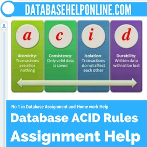

# mac에서 환경변수추가(터미널에서 글로벌하게 명령어를 실행하기 위해서)
```
sudo nano /etc/paths
```
원하는 프로그램이 있는 bin패스를 추가한다.
```
...
/Library/PostgreSQL/10/bin

```
그리고 저장한다.
터미널을 끄고 다시 키면 적용이 완료된다.
# prisma_db_server 에서
prisma init
-> 기존의 mysql 디비 등을 사용할 것인지 콘설에서 선택(demo server인가 하믄 얘네가 주는 임시서버를 사용할 수 있음)
-> 최종적으로 명령을 한 pwd 에서 datamodel.prisma, prisma.yml 생성

prisma deploy
-> datamodel.prisma를 임의대로 수정한뒤에 이 명령어를 치면 서버의 데이터베이스 스키마가 바뀐다.

npm start
-> 사실 `node src/server.js` 인데, 이는 그래프큐엘 요가 서버를 킨다는 의미, 이 서버의 리졸버들은 prisma가 디플로이될때 생성된 `generated`에 의존하고 있다.


# Linux, unix 글로벌 환경변수(node에서도 process.env로 접근 할 수 있는)
```
nano ~/.bashrc
```
맨 마지막줄에 아래와같이 삽입한다.
```
export 내가원하는변수명=할당하고싶은값
```
이렇게하고 저장후 콘솔을 끄고 다시 접속하면 변경되어있따.

# Tips during study
1. 마크다운에서 nested list는 스페이스 네번을 치고 다시 리스트를 쓰면된다.
2. transaction

    누군가 어떤 것을 사거나 팔 때 혹은 돈이 오갈 때, 혹은 사거나 파는 행위 자체를 의미한다. (an occasion when someone buys or sells something, or when money is exchanged or the activity of buying or selling something).

    데이터베이스에서 트랜잭션이란 상호작용의 단위이다. 이론적으로 DBMS는 원자성(Atomicity), 일관성(Consistency), 독립성(Isolation), 영구성(Durability)을 보장한다. 이 성질을 첫글자를 따 ACID라 부른다.

    어떤 시스템들에서는 트랜잭션들은 논리적 작업 단위(LUW, Logical Units of Work)로 불린다.

    한마디로 쿼리가 DBMS에 보내지고, 해당 쿼리를 실행하고, 그 실행이 성공하기 까지의 처리과정을 한 단위로 묶어 트랜잭션이라 한다.

    더 쉽게 말하면 그냥 쿼리 보내고 잘 실행 됐는가가 한 트랜잭션이다.
3. fetch
    
    가지고 오다. go for and then bring back (someone or something) for someone.

4. tuple

    유한 개의 사물의 순서 있는 열거. 수학에선 벡터 컴퓨터 사이언스에서는 어떤 요소의 집합 혹은 테이블의 한 row를 가리킨다(=record). 단 일반적인 집합과달리 중복이 허용될 수 있다. 대개는 괄호 '( )'안에 쉼표 ','로 구분한다. 예를들어 (2, 7, 4, 1, 7)와 같다.

5. 막간 괄호 표현 정리
    - () parentheses
    - {} curly bracket or brace
    - [] square bracket or just bracket(US)
    - <> pointy bracket or less than greater than

6. MySQL도 영리 목적은 유료! PostgreSQL은 영리도 무료!

    찾으면서 알게 된 사실인데 MySQL도 완전한 무료가 아니다. 영리 목적으로 사용시에는 유료 버전을 써야하고 유료버전의 가격은 2000~10000달러 사이이다. 무료 버전은 GPL(General Public License)이 적용되어 있어 MySQL 내부의 소스 코드 수정시 공개해야하지만 유료버전은 소스 공개의 위험이 없다. 유료버전은 고객지원이 좋지만 무료버전은 없다.

7. BSD 라이센스
    
    - BSD 운영체제 : 는 1977년부터 1995년까지 미국 캘리포니아 대학교 버클리(University of California, Berkeley)의 CSRG(Computer Systems Research Group)에서 개발한 유닉스 운영 체제이다.
    - BSD 라이선스 : 해당 소프트웨어는 아무나 개작할 수 있고, 수정한 것을 제한 없이 배포할 수 있다. 다만 수정본의 재배포는 의무적인 사항이 아니므로 BSD 라이선스를 갖는 프로그램은 공개하지 않아도 되는 상용 소프트웨어에서도 사용할 수 있다.

8. ACID(Atomicity, Consistency, Isolation, Durability)

    데이터베이스 트랜잭션이 안전하게 수행된다는 것을 보장하기 위한 성질을 가리키는 약어이다.
    
    

    - Atomicity : Transaction are all or nothing. 트랜잭션중에 중단 안됨 보장!
    - Consistency : Only valid data is saved. 유효성을 체크하고 저장하기 때문에 일관된 데이터타입 보장!
    - Isolation : Transactions do not affect each other. 트랜잭션중 다른 트랜잭션끼지 못하게 보장!(스택!)
    - Durability : Wirtten data will not be lost. 트랜잭션이 끝나면 쓰여진 데이터는 시스템이 꺼져도 저장된다는 것을 보장!(비휴발성 non-volatile 메모리에 저장된다는 것을 의미)

9. DbaaS(DB As A Service)

    한마디로 DB를 클라우드로 제공해주는 서비스. 이런 회사들이 많아졌다.

10. scratch

    모두들 사용해봤을 블록코딩 프로그램의 이름이기도 한데 출발점이란 뜻도 있다. 

11. ORM

    Object-relational mapping의 약자이다. 컴퓨터 사이언스에서 데이터(DB)를 호환되지 않는 다른 타입시스템(이를테면 백엔드)에서 객체지향 언어를 통해 컨버팅해주는 기술이다.

12. Type system

    프로그래밍 언어에서 타입시스템이란 타입이라고 부르는 프로퍼티를 컴퓨터 프로그램의 다양한 구조(예를 들어 변수, 표현식, 함수, 모듈)에 할당하는 규칙의 집합이다. 이러한 타입(데이터 형)은 프로그래머가 데이터 타입이나 구조, 기타 구성 요소를 정규화하고 타입을 강제합니다.
    한마디로 static typing이라고 생각하면 될듯.
